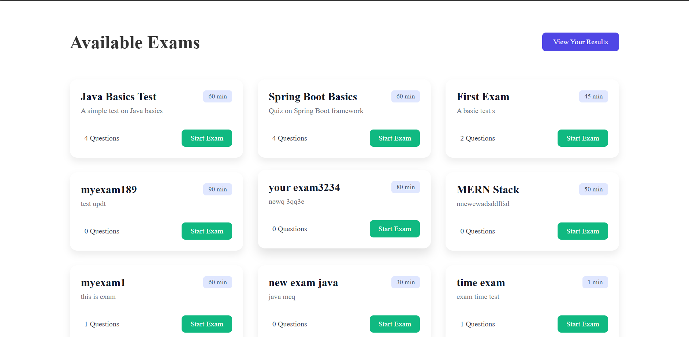
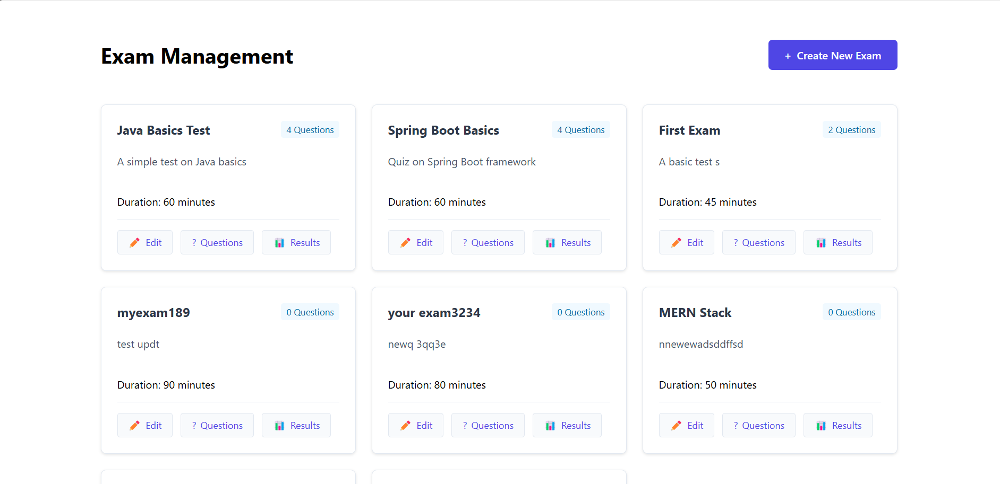
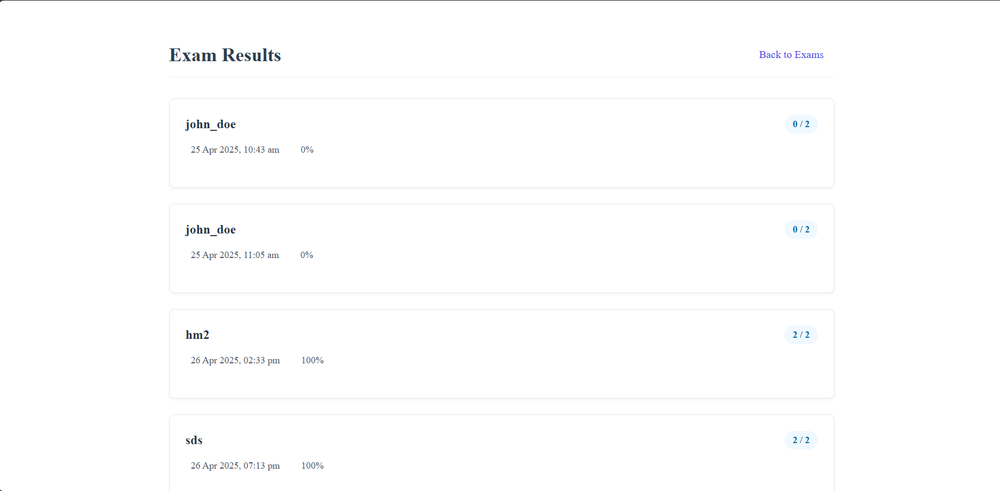

# 📚 Online Exam Portal


An Online Exam Management System built with **Spring Boot 2.3.3**, **Angular CLI**, **MySQL (via XAMPP)**, and **Java 17**.

---

## ✨ Features

- 📝 Create and manage online exams
- 🎯 Conduct timed quizzes and tests
- 👨‍🎓 Student registration and login
- 👩‍🏫 Admin panel for managing exams and questions
- 📊 Instant result evaluation and analysis
- 🔒 Secure authentication and authorization
- 🌐 Responsive and user-friendly UI

---

## 🛠️ Tech Stack

| Frontend | Backend | Database |
|:--------:|:-------:|:--------:|
| Angular | Spring Boot | MySQL |

---

## 🖥️ Languages Used

- **HTML5**
- **CSS3**
- **TypeScript** (for Angular)
- **Java** (for Spring Boot backend)
- **SQL** (for database)

---

## 🚀 Getting Started

### 1. Clone the repository

```bash
git clone https://github.com/mulayharshal/OnlineExamPortal.git
cd OnlineExamPortal
```

### 2. Set up the Backend

```bash
cd Backend
```
- Open the project in your favorite IDE (IntelliJ IDEA, Eclipse, etc.)
- Configure MySQL database settings in `src/main/resources/application.properties`
- Run the Spring Boot application

### 3. Set up the Frontend

```bash
cd "Front End"
```
- Install dependencies:

```bash
npm install
```

- Start the Angular development server:

```bash
ng serve
```
By default, it runs at [http://localhost:4200](http://localhost:4200)

---

## ⚙️ Backend Configuration

Edit the `application.properties` file:

```properties
spring.datasource.url=jdbc:mysql://localhost:3306/online_exam_db
spring.datasource.username=root
spring.datasource.password=yourpassword
spring.jpa.hibernate.ddl-auto=update
server.port=8080
```

---

## 📸 Screenshots

### Home Page


### Admin Dashboard


### Results Page



---

## 💡 Future Enhancements

- Add OTP-based authentication
- Timer with auto-submit for exams
- PDF generation for results/certificates
- Real-time monitoring for online exams
- Analytics dashboard for admin users

---
